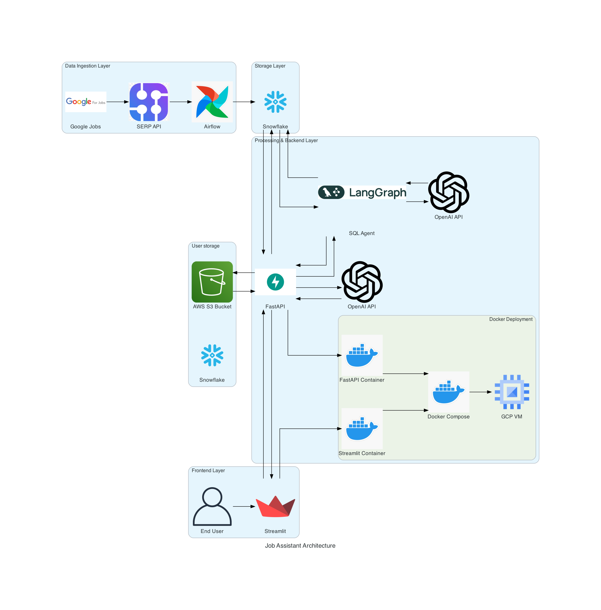

# Intelligent Job Search Assistant

## Members:
- **Viswanath Raju Indukuri**
- **Snehal Shivaji Molavade**
- **Sai Vivekanand Reddy Vangala**

---

## Architecture

The project leverages a multi-layered architecture with the following technologies:
- **Backend**: FastAPI for handling APIs and integrating with LLMs.
- **Frontend**: Streamlit for user interaction and visualizations.
- **Database**: Snowflake for storing user and job data.
- **Storage**: AWS S3 for managing uploaded files (resumes and cover letters).
- **Data Scraping**: Google SERP API for fetching job listings.
- **Analytics**: Descriptive and visual insights using integrated modules.
- **Deployment**: Dockerized application with CI/CD via GitHub Actions and hosting on GCloud VM.

  

---

## Links

1. **Codelabs Report**: [View Report](https://codelabs-preview.appspot.com/?file_id=1JGeUAieHgwrS8Kxsetu1_HHAeJsj8REv8EMC-kxBqW0#0)
2. **Proposal Video**: [Watch Video](https://drive.google.com/file/d/1ZTxtyVhNEEwmCC3hwdfxsJBteny_4MPQ/view)

---
